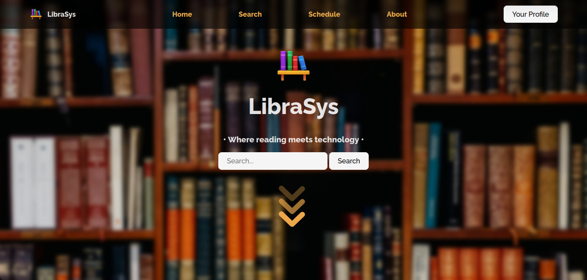

# LibraSys

• Where reading meets technology •

This is an online library management system that would be connected to a physical library in order to manage it's books and users, and allow users to browse and borrow books.

## Previews

### Home page

`Note: The dialog at the end is supposed to say days not ms :p`

### Admin facing

`Note: I set up the project to allow external users for testing, I changed the user type to internal later so that only users from the BITS organization can log in`

## CRUx Dev Induction Round 3: Web Development

You will build a website with a backend in Express.js, and TypeScript and a frontend in Svelte or React during this task.

## Technologies used

Some of the technologies used in the project are:

* Svelte - Front-end framework
* Svelte Material UI - UI Library
* Node.js - Back-end runtime environment
* Express.js - Web framework
* SQLite3 - Database
* Passport.js - For authentication with OAuth 2.0
* Redis - In-memory data store for caching
* RabbitMQ - For event queuing
* Nodemailer - Email service
* node-cron - Cron-like jobs for scheduling

## Getting Started

To get started with LibraSys, follow these instructions to set up the project locally on your machine.

## Prerequisites

Before you begin, ensure that you have the following installed:

    Node.js
    Redis server
    RabbitMQ

Clone this repository

    $ git clone https://github.com/megz15/LibraSys.git

Install required dependencies both in the root directory and the svelte directory

    $ npm i

Create a .env file in the server directory with the following environment variables:

    GOOGLE_CLIENT_ID=''     # replace these empty strings
    GOOGLE_CLIENT_SECRET='' # with your own values
    JWT_SECRET=''
    PROJECT_EMAIL=''
    PWD=''
    EXPIRYMS=''

## Compile Svelte code

Go to the svelte directory and run

    $ npm run build

This will generate the `public` directory that the server serves files from. 
Ignore the yellow warnings.

## Start redis-server and rabbitmq-server

Follow the official instructions to install redis-server and rabbitmq-server on your system

    https://www.rabbitmq.com/download.html
    https://redis.io/docs/getting-started/installation/

Start the servers. Default configs are used in the project.

## RabbitMQ Plugin

Install the Delayed Messaging plugin for RabbitMQ. 
This enables users to schedule custom email notifications for a book for a later date.

    https://github.com/rabbitmq/rabbitmq-delayed-message-exchange

## Start the server

Go to the root directory and run

    $ npm run dev

Open [localhost:3000](http://localhost:3000/) to access the website.

## Initialize some books

Go to [localhost:3000/api/initBooks](http://localhost:3000/api/initBooks) to add some dummy books.

# Official instructions

## Task: Build a Library website

1. Your website should have the following features:
    - [x] Basic CRUD functionality for users
        - [x] Every user should have an email, a name, and a username/handle.
        - [x] Users should be authenticated with Google OAuth, and only users from the BITS organization should be able to login.
   - [x] Two types of users: User, and Admin
        - [x] Admins should be able to CRUD Users
    - [x] Basic CRUD functionality for books:
        - [x] Admins should be able to CRUD books
        - [x] Books should have a name, genre, author, a code for where it is placed, how many copies are available in the library, and a count for how many of the copies have been borrowed.
        - [x] Users should be able to look at the books available, and the results should be paginated
    - [x] Users should be able to borrow books for a fixed period of time. At any point a user can borrow a maximum of 3 books.
    - [x] Admins should be able to mark a book as returned. This will only increase the number of books available for borrowing by 1, not by the number of copies of the book.
2. Figure out the fastest and most secure way to use JWTs for authentication, and implement it. If you don’t have the time to implement it, at least read up on it, and we might have a discussion about this during the interview.
3. - [x] You should be able to filter by Genre, and filter by Author. The results should, of course, be paginated.
4. - [x] Cache search results and book information in Redis, and use LRU, and set an expiry time for cached results.
5. - [x] Use a message broker or Event Queue like RabbitMQ or Kafka to allow users to schedule email reminders at certain dates for custom messages, for e.g. Reminders for returning a book, or reminders for completing some chapters in the book, etc.
6. - [x] Brownie points: Users should be able to subscribe to a book, and should receive email notifications when the book is available again for issuing.

## You’ll be judged on the following

1. Coding best practices (modularity, conciseness, etc.).
2. How well and fast you pick up new concepts.
3. Having clear concepts (including relevant theory) on what is being used in the said tasks, and in general what frameworks you use.
4. How secure your API is, and various measures against some basic vulnerabilities.
5. How well you handle errors.

## General Instructions

1. Do not plagiarize, but feel free to use the internet.
2. Use git to record your progress over the given period, and label your commits properly.
3. Once done with your tasks, write a post on the CRUx community forum regarding the same. The post is not part of the inductions, it's for future applicants and the GB to check out your projects. Follow a similar pattern to those who posted from previous inductions.
4. If you have problems with any task, feel free to ask the task setters/mentors.
